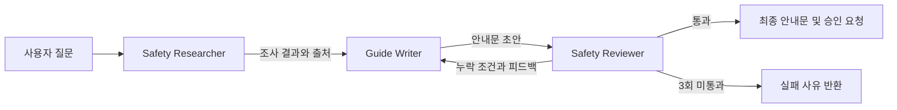
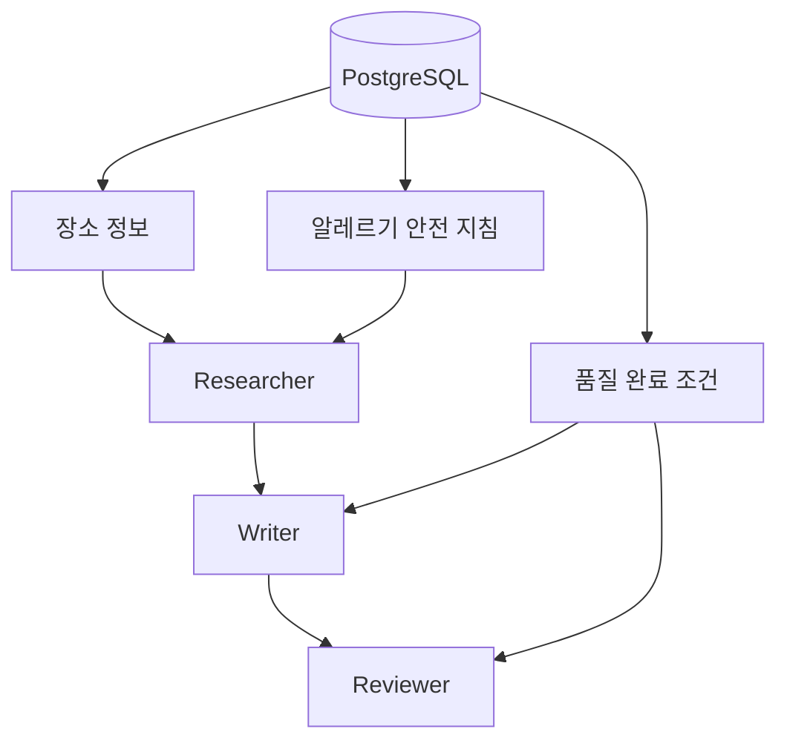
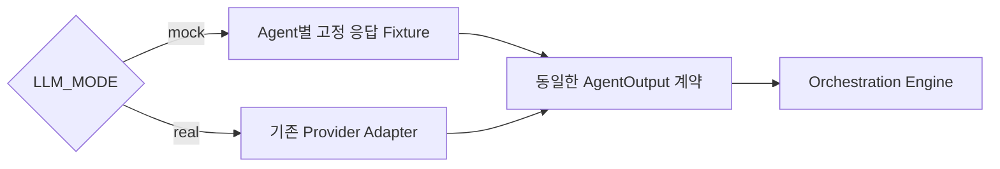

# 부산 알레르기 안전 안내문

## 1. 과제 요약

| 항목 | 내용 |
| --- | --- |
| 시나리오 | `my_orchestration` |
| 사용자 질문 | 부산의 장소와 알레르기 안전 수칙을 조사하고 안내문을 작성한 뒤 필수 내용을 검토해 줘. |
| 핵심 패턴 | Sequential + Evaluator–Reviser |
| 데이터 | PostgreSQL의 부산 장소·알레르기 지침·완료 조건 |
| LLM 방식 | 기본값 Mock, 선택적으로 실제 LLM 전환 |
| 완료 결과 | 검증을 통과한 안내문, 출처, 사용자 승인 요청 |

목표는 답변 품질이 아니라 **Agent 연결, Context 전달, 평가와 반복 종료가 올바르게 동작하는지 빠르게 검증하는 것**이다.

## 2. 패턴 설계

### 패턴 조합

| 패턴 | 적용 구간 | 책임 | 선택 이유 |
| --- | --- | --- | --- |
| **Sequential** | Researcher → Writer → Reviewer | 앞 단계 출력을 다음 단계 입력으로 전달 | 조사 전에는 작성할 수 없고 초안 전에는 평가할 수 없음 |
| **Evaluator–Reviser** | Reviewer ⇄ Writer | 누락 조건을 피드백하고 기준 충족까지 반복 | 검토에서 끝내지 않고 완성된 안내문을 만듦 |
| **Provider Strategy** | Agent → Mock/Real Provider | 실행 방식만 교체하고 동일 계약 유지 | Mock 전환이 업무 흐름에 영향을 주지 않게 함 |

`my_orchestration`은 별도의 지능형 Agent가 아니라 패턴의 실행 상태를 관리하는 **결정적 제어자**다. 다음 Agent, 전달 Context, 현재 회차, 종료 이유를 관리하며 콘텐츠 사실은 만들지 않는다.

### 상태 전이



- Research가 실패하거나 근거가 비어 있으면 Writer를 실행하지 않는다.
- Review가 통과하면 종료하고, 실패하면 피드백을 포함한 새 Revision을 만든다.
- 최대 3회 반복과 종료 조건은 Reviewer가 아니라 `my_orchestration`이 강제한다.

### 선택하지 않은 패턴

| 패턴 | 제외 이유 |
| --- | --- |
| Parallelization | 현재는 한 DB의 작은 조회 범위여서 병렬 Worker 통합 비용이 더 큼 |
| Router | 하나의 질문 유형만 처리하므로 경로 분류가 필요하지 않음 |
| Handoff | 담당 책임을 다른 업무 도메인으로 이전하지 않음 |
| Supervisor–Worker | Agent와 실행 순서가 고정되어 동적 Worker 선택이 필요하지 않음 |

## 3. Agent와 Tool

| Agent | 입력 → 출력 | Tool | 완료 조건 |
| --- | --- | --- | --- |
| `allergy_research_agent` | 사용자 질문 → 장소·안전 지침·출처 | `search_places`, `get_allergy_guidance` | 모든 사실에 출처가 있고 추정 내용이 없음 |
| `allergy_guide_writer_agent` | 조사 결과·검토 피드백 → 안내문 초안 | `get_quality_requirements` | 조사 결과 밖의 사실 없이 필수 항목 반영 |
| `allergy_guide_reviewer_agent` | 안내문 초안 → 통과 여부·누락·피드백 | `check_required_terms`, `get_quality_requirements` | 모든 조건을 항목별로 판정 |



각 Agent에는 표에 적힌 Tool만 허용한다. Tool이나 DB가 실패하면 임의 데이터로 대체하지 않는다.

## 4. 통과 기준

Reviewer는 아래 조건을 모두 만족할 때만 통과시킨다.

1. 장소와 안전 지침의 출처가 포함되어 있다.
2. 방문 전에 식재료와 교차접촉 가능성을 직접 확인하도록 안내한다.
3. 중증 증상이 의심될 때 119 신고 안내가 있다.
4. 게시·사용 전에 사용자 승인을 요청한다.
5. DB에 없는 장소의 안전성이나 의학적 판단을 확정하지 않는다.

최대 3회 안에 통과하지 못하면 누락 조건과 마지막 피드백을 반환하고 종료한다.

## 5. Mock LLM 전환안

개인 파일럿에서는 실제 LLM을 호출하지 않는다. 환경 변수로 실행 방식을 선택한다.

```dotenv
LLM_MODE=mock
```



### 동작 규칙

- `mock`: Provider API를 호출하지 않고 Agent별 Fixture를 반환한다.
- `real`: 기존 OpenAI·Gemini·Ollama·Gemma Adapter를 사용한다.
- 두 모드는 동일한 `AgentOutput` 형식을 반환해 Orchestration 코드를 변경하지 않는다.
- 기본값은 개인 실습 목적에 맞게 `mock`으로 둔다.
- Mock은 LLM 응답만 대체한다. 부산 사실과 완료 조건은 계속 PostgreSQL/MCP에서 조회한다.

### Agent별 Mock 응답

| Agent | Fixture 내용 |
| --- | --- |
| Researcher | Tool 결과의 장소·안전 지침·출처를 정해진 형식으로 요약 |
| Writer | 1차에는 일부 조건을 누락하고, 피드백 수신 후 완성 초안을 반환 |
| Reviewer | 필수 문구 검사 결과에 따라 통과 여부와 수정 피드백 반환 |

Writer의 1차 실패와 2차 통과를 고정하면 재작성 루프와 종료 조건을 반복 실행해도 같은 결과로 검증할 수 있다.

## 6. Agent 간 계약

### 현재 파일럿 계약

Mock과 실제 Provider는 모두 동일한 `AgentOutput`을 반환한다.

```text
AgentOutput
├─ agent_id: 실행 Agent ID
├─ summary: 다음 단계에 전달할 결과
├─ recommendations: 수정 피드백 또는 다음 행동
└─ completed: Agent 작업 완료 여부
```

공통 계약은 빠른 파일럿에는 적합하지만 다음 Agent가 `summary` 문자열을 다시 해석해야 한다. 후속 단계에서는 역할별 계약으로 분리한다.

### 목표 출력 계약

```text
ResearchOutput
├─ facts[]: fact, source_url, verified_at
├─ safety_guidance[]: guidance, emergency, source_url
└─ completed

DraftOutput
├─ draft
├─ used_sources[]
├─ included_requirements[]
└─ revision: 1..3

ReviewOutput
├─ passed
├─ missing_requirements[]
├─ unsupported_claims[]
└─ feedback
```

### 단계별 전달 계약

| 전달 | 선행 조건 | 보장 값 | 위반 시 처리 |
| --- | --- | --- | --- |
| Research → Writer | 완료 상태이며 근거가 하나 이상 | 사실별 출처와 검증일 | Writer를 호출하지 않고 `research_failed` 종료 |
| Writer → Reviewer | 초안이 있고 Revision이 1~3 | 사용 출처와 반영 요구사항 | 해당 회차 실패 처리 |
| Reviewer → Writer | `passed=false` | 누락·근거 없는 주장과 수정 피드백 | 회차를 증가시켜 재작성 |
| Reviewer → Final | `passed=true`, 누락 없음 | 최종 초안과 사용자 승인 요청 | `evaluation_passed` 종료 |

### 오류·종료 계약

```text
RunResult
├─ status: completed | failed
├─ summary: 통과한 안내문 또는 null
├─ termination_reason
│  ├─ evaluation_passed
│  ├─ research_failed
│  ├─ tool_error
│  └─ max_revisions_exceeded
├─ error: 실패 원인 또는 null
└─ trace: Agent, Tool, 회차, Mock/Real 모드
```

Mock Fixture도 계약을 우회하지 않는다. 잘못된 Fixture는 실제 LLM의 잘못된 구조화 응답과 동일하게 계약 위반으로 실패한다.

## 7. 검증 항목

- Mock 모드에서 외부 LLM API가 한 번도 호출되지 않는다.
- Research → Writer → Reviewer 순서와 Context 전달이 정확하다.
- 119 또는 사용자 승인 문구가 없으면 Reviewer가 실패시킨다.
- Reviewer 피드백이 다음 Writer 입력으로 전달된다.
- 3회 반복 제한과 통과 종료가 정확하다.
- DB·MCP 장애를 성공 응답으로 바꾸지 않는다.
- 허용되지 않은 Tool 호출을 차단한다.
- 같은 입력은 매번 같은 Mock 결과와 Trace를 만든다.

## 8. 구현 순서

1. `LLM_MODE` 설정과 Mock Provider를 추가한다.
2. Agent별 Mock Fixture를 작성한다.
3. `my_orchestration`에 최대 3회의 재작성·재평가 루프를 추가한다.
4. Mock/실제 Provider가 같은 출력 계약을 사용하는지 확인한다.
5. 정상·누락·반복 한도·Tool 실패 테스트를 실행한다.

이번 개인 실습의 완료 기준은 **Mock 모드만으로 전체 흐름과 실패·반복·종료 조건을 재현할 수 있는 상태**다.
